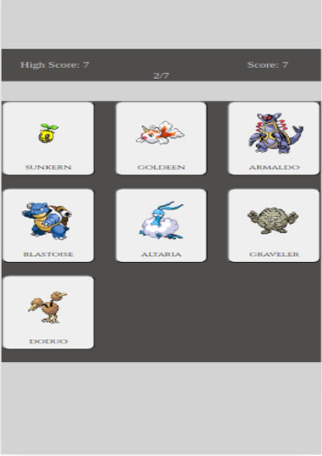

# React + Vite
# Pokémon Memory Game

**Description:**
This is a memory game built using React and Vite that challenges players to identify unique Pokémon from a dynamically generated board. The game progressively increases in difficulty as more Pokémon are added with each level.

[](https://youtu.be/kmd_FuJVjjM)

**Features:**
- Utilizes the Pokémon API to fetch Pokémon names and sprites.
- Ensures all displayed Pokémon are unique, avoiding duplicates in each level.
- Game levels incrementally increase the number of Pokémon on the board.
- Includes satisfying sound effects for correct and incorrect actions, designed with minor human factors in mind to enhance user experience.
- Displays the score and high score upon game over.

## Getting Started

### Prerequisites
- Node.js (version 14 or higher)
- npm (version 6 or higher)

### Installation
1. Clone the repository:
    ```bash
    git clone https://github.com/yourusername/pokemon-memory-game.git
    ```
2. Navigate to the project directory:
    ```bash
    cd pokemon-memory-game
    ```
3. Install dependencies:
    ```bash
    npm install
    ```

## Usage

### Running the Project
To start the game, run:
```bash
npm run dev
